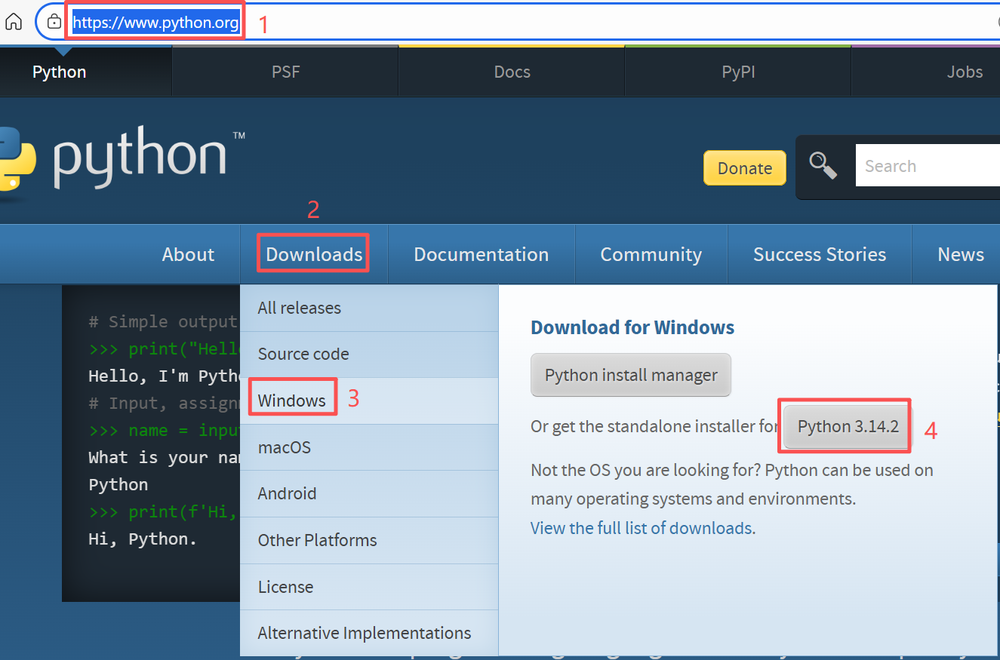

# Jupyter Notebook学习笔记

Jupyter Notebook是一款开源的、基于Web的交互式计算环境，广泛用于数据分析、机器学习、科学计算和教学。Jupyter Notebook不仅可以编写和执行代码，还可以嵌入Markdown文本和LaTeX数学公式，方便用户在一个文档中进行编程、注释、公式推导、结果展示和报告生成。支持丰富的输出格式，包括图表、图片、动画等，可以通过Matplotlib、Seaborn、Plotly等库进行强大的数据可视化。

## 一、安装Jupyter Notebook

使用pip安装Jupyter Notebook，请按照以下步骤操作:

### 1.安装Python和pip

Jupyter Notebook需要Python环境支持。如果你尚未安装Python，请先下载并安装Python(建议使用Python 3.3及以上版本)。安装Python时，pip通常会自动安装，Pip是Python的包安装工具。

在Python官网（https://www.python.org/）下载并安装Python(建议使用Python 3.3及以上版本)，如下图所示：

<div align='center'>

</div>

安装Python时，pip通常会自动安装。检查pip是否已安装的命令:
`pip --version  #查询pip安装版本及安装位置`

### 2.升级pip(可选)

为了避免依赖项安装问题，建议先将pip升级到最新版本:
`python.exe -m pip install --upgrade pip`

### 3.安装Jupyter Notebook

在命令行中输入以下命令安装JupyterNotebook：` pip install notebook`

### 4.修改Jupyter Notebook默认工作路径

Jupyter Notebook启动时默认的工作路径通常是当前用户的主目录:`-Windows:C:\Users\<用户名>`
(1)打开命令行工具，输入以下命令生成配置文件:
`jupyter notebook --generate-config`
这会在默认路径(通常是C:\Users\你的用户名\.jupyter)下生成一个名为jupyter_notebook_config.py 的文件。

(2)用文本编辑器(如记事本或VSCode)打开。使用Ctrl+F 搜索以下内容:
`# c.NotebookApp.notebook_dir = ''  `
删除行首的#，并在单引号内输入你希望设置的根目录路径。例如:
c.NotebookApp.notebook_dir = 'E:\\jupyter_notebook'
注意:路径中的反斜杠\需要写成双反斜杠\\。如果没有找到c.NotebookApp.notebook_dir="，可以直接复制过去。

(3)保存配置文件后，重启Jupyter Notebook，它就会以你设置的路径作为根目录启动。

## 二、安装中文语言包

默认Jupyter Notebook是英文界面，可以使用以下命令安装中文语言包。
`pip install jupyterlab-language-pack-zh-CN`

## 三、使用Jupyter Notebook

### 3.1 启动与界面

·启动:在终端输入 `jupyter notebook`，浏览器会自动打开Jupyter 的界面http://localhost:8889/tree。
界面:主界面是文件管理器，可以创建、打开和管理.ipynb文件。

### 3.2 创建 Notebook

点击右上角的”New”按钮，选择"Python3"创建一个新的Notebook。默认文件名为Untitled.ipynb，可以重命名。

## 四、安装extension插件

### 4.1 插件nbextensions:Jupyter Notebook代码自动补全

在命令行下输入以下代码：

```
    pip install jupyter_contrib_nbextensions
    jupyter contrib nbextension install --user
    pip install jupyter_nbextensions_configurator
    jupyter nbextensions_configurator enable --user
```

执行完这些命令后，启动 Jupyter Notebook，就能在顶部菜单栏看到 “Nbextensions” 选项卡，在其中可以自由管理扩展。

- pip install jupyter_contrib_nbextensions
  使用 pip 安装 jupyter_contrib_nbextensions 包。这个包是一个扩展集合，包含了大量实用的 Jupyter Notebook 插件，例如代码折叠、目录生成、拼写检查等。
- jupyter contrib nbextension install --user
  将上一步安装的扩展集合安装到 Jupyter 中，使其能被 Notebook 识别和使用。--user 表示仅对当前用户生效，避免影响系统其他用户。
- pip install jupyter_nbextensions_configurator
  安装 jupyter_nbextensions_configurator，这是一个图形化配置工具，用于方便地启用、禁用和管理各个扩展。
- jupyter nbextensions_configurator enable --user
  启用配置器扩展，使 Jupyter Notebook 的界面中出现一个 “Nbextensions” 标签页，用户可以通过勾选的方式直观地开启或关闭扩展。
