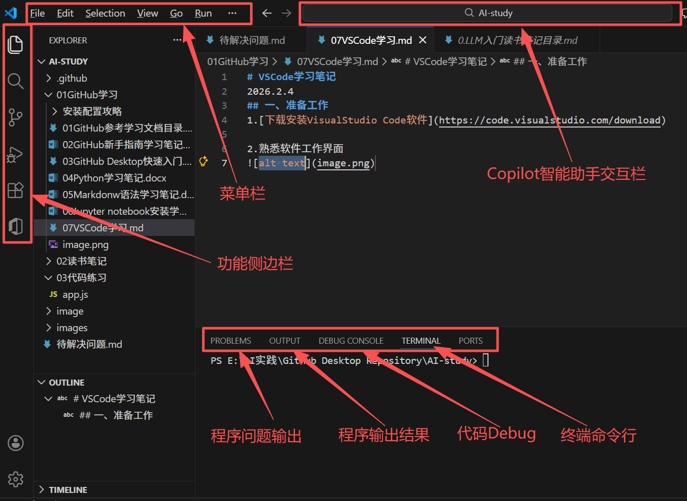
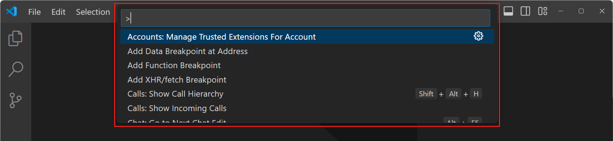
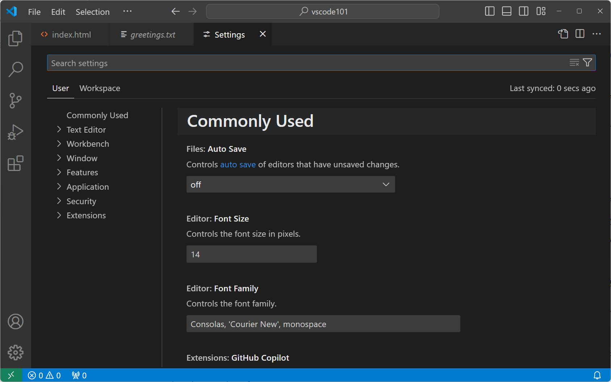
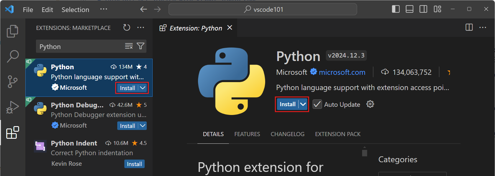

# VSCode学习笔记

2026.2.4

## 一、准备工作

1.[下载安装VisualStudio Code软件](https://code.visualstudio.com/download)

2.熟悉软件工作界面

3.命令面板使用\

* 在命令面板输入框中输入">"，表示命令查找；\
* 在命令面板输入框中直接输入文字，表示搜索该文字；
  

4.配置VS Code设置

* 选择File > Preferences > Settings，打开VS Code设置面板，如下图：
  
* 在设置面板的搜索栏中输入“@modified”,可以查看哪些默认配置被修改过。

## 二、VS Code使用

1.代码编写

* 可以编写.md、.js等文件，并调试运行；2.[源代码控制(Source Control)](https://code.visualstudio.com/docs/sourcecontrol/overview)
* VS Code 集成了源代码管理（SCM），并开箱即用 Git 支持。

3.安装语言扩展
在扩展视图搜索框中输入 Python，以浏览与 Python 相关的扩展。选择由 Microsoft 发布的 Python 扩展，然后选择安装按钮。

4.run and debug代码

* [vs code代码调试官方文档](https://code.visualstudio.com/docs/debugtest/debugging)

5.用AI和GitHub Copilot提升编程能力GitHub Copilot 是一款由人工智能驱动的助手，帮助您更快地编写代码，并能协助完成代码完成、代码重构和错误修复等多种任务。\

* [GitHub Copilot安装](https://code.visualstudio.com/docs/copilot/setup)\
* [GitHub Copilot快速入门](https://code.visualstudio.com/docs/copilot/getting-started)
