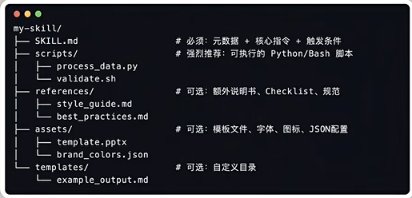
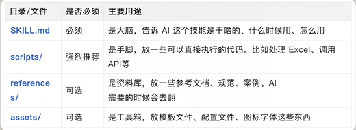

# Skill学习笔记

2026.2.7

Skills是把临时的、通用的Prompt变成永久保存的知识资产。
这种模式好处：AI采用渐进式披露机制，接收到具体任务时才会读取scripts和references下的文件资料。具体优势如下：

1.节省Token就是省钱；

2.可积累、传承、交易，挣钱；

3.社区共建，skills生态非常繁荣，github上anthropics有一款skill-creator可以用skills生成skills

Skill文件夹结构

