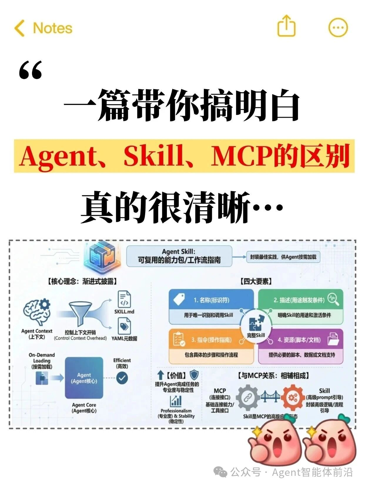
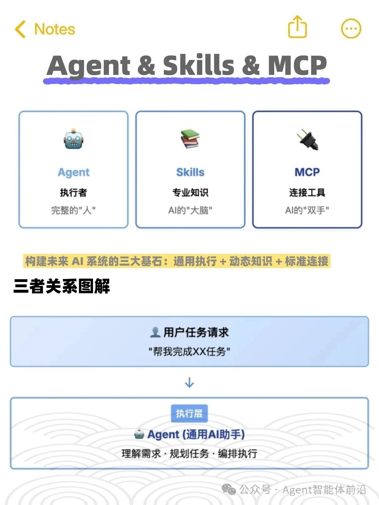
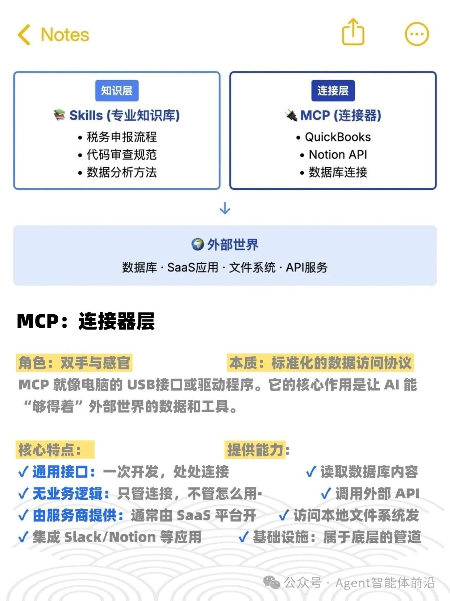
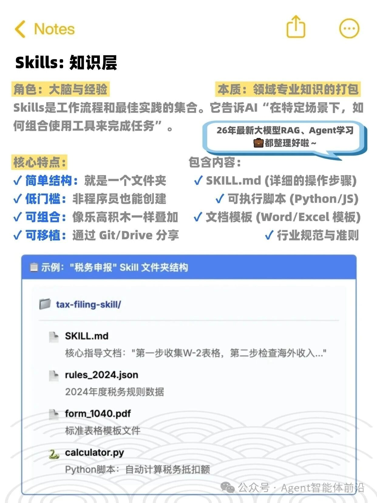
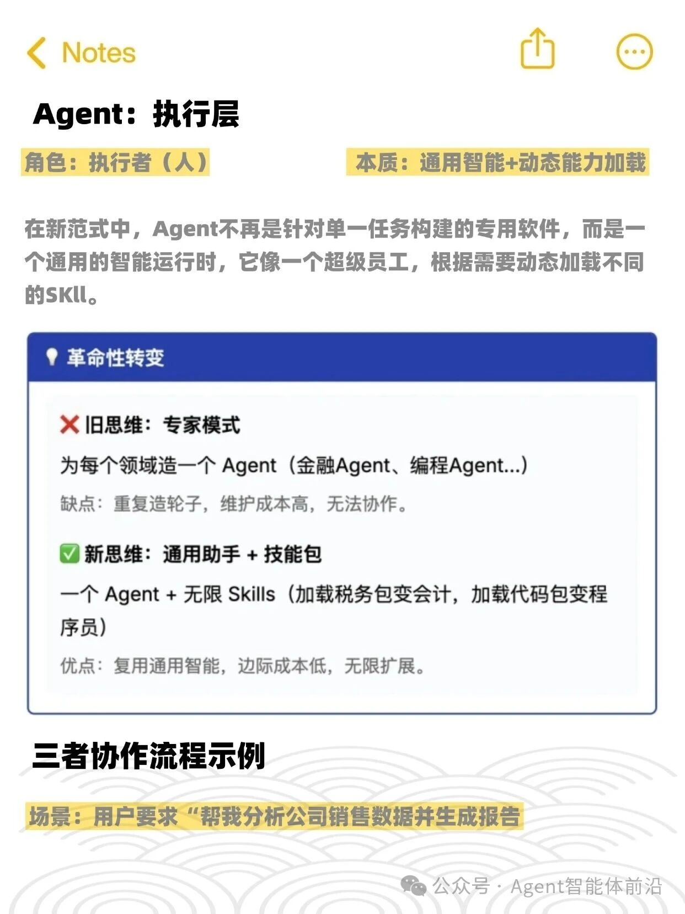
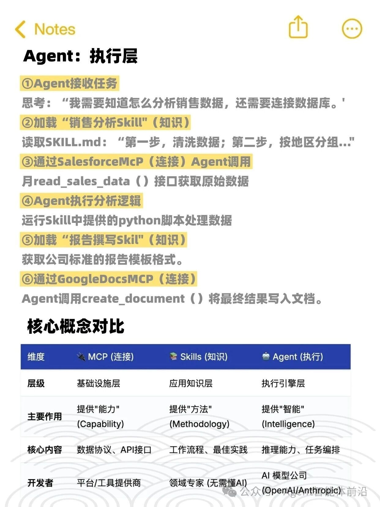
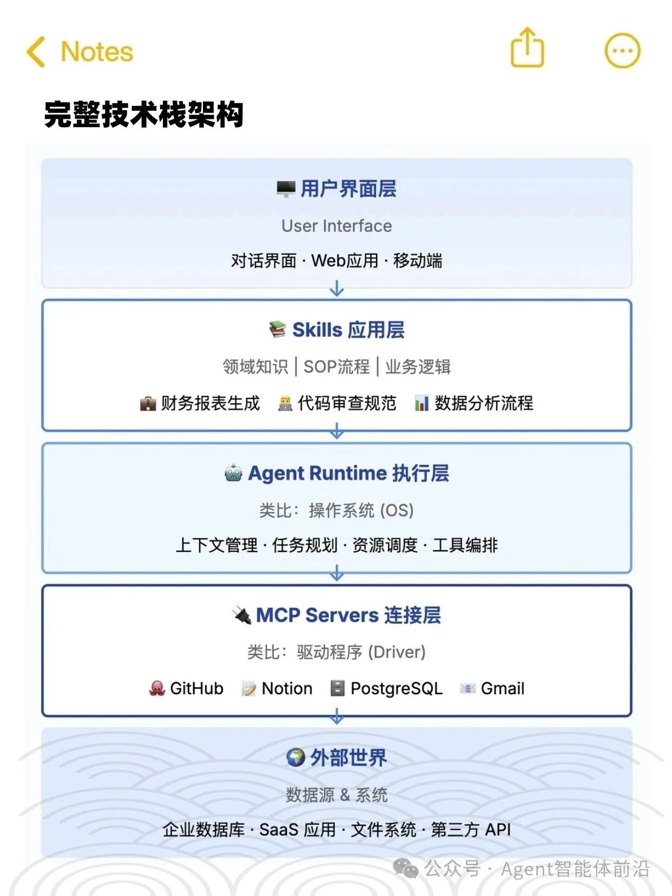
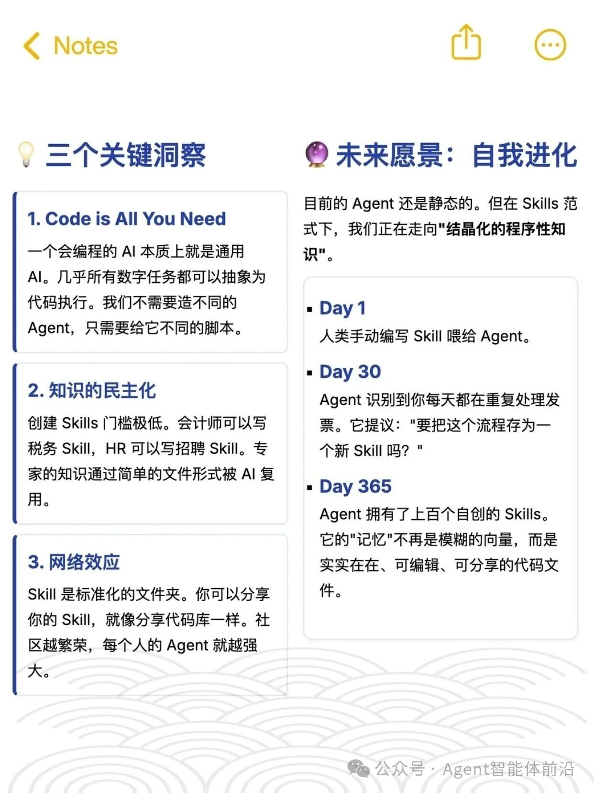

# Agent、Skill、MCP关系1
2026.2.15
一定要认真拜读[**Anthropic Agent Skills 官方文档**](https://claude.com/blog/equipping-agents-for-the-real-world-with-agent-skills)。
## 1.三者总体关系图

## 2.三者关系图解

## 3.三者简介

## 4.三者协作

## 5.总结

##