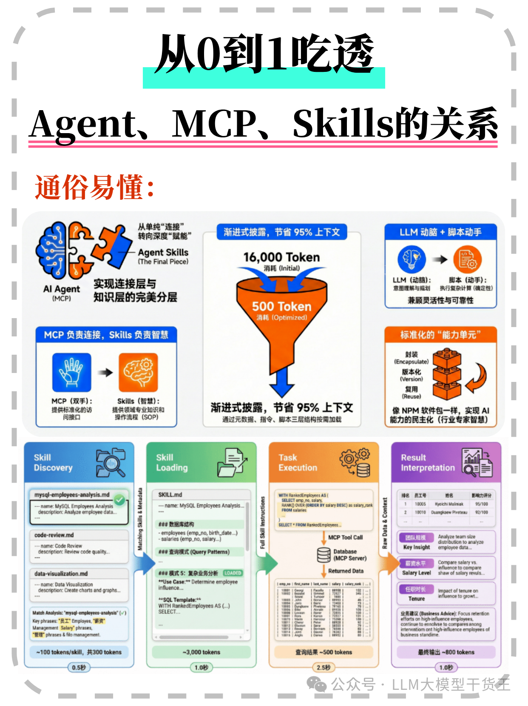
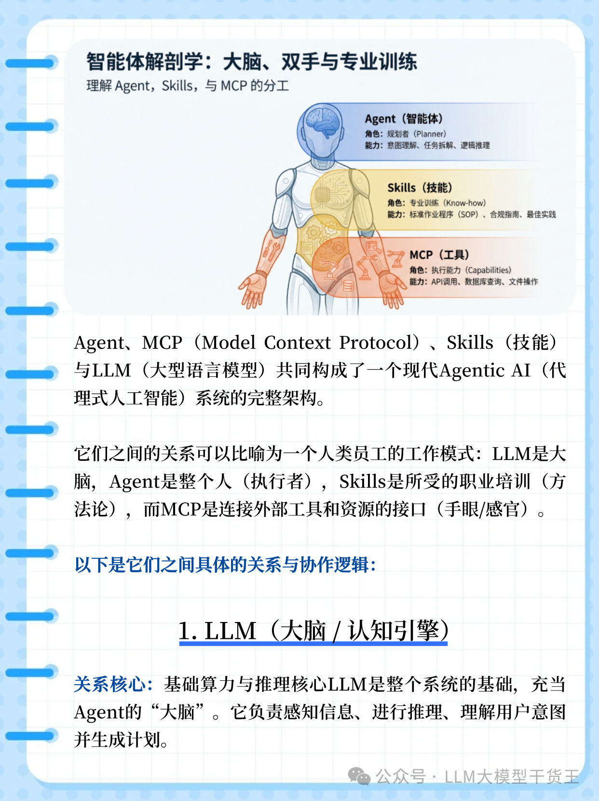

# Agent、Skill、MCP关系2
2026.2.16

## 1.三者总体关系图

## 2.LLM(大脑/认知引擎)
* 关系核心：基础算力与推理核心LLM是整个系统的基础，充当Agent的“大脑”。它负责感知信息、进行推理、理解用户意图并生成计划。
* 局限性：仅靠LLM本身是被动的(PassiveAI)，它只能生成文本，无法直接接触外部数据或执行操作，就像一个“被困在盒子里的天才”
* 作用：在Agent架构中，LLM负责决策一一决定下一步该做什么，调用哪个工具，或者使用哪种技能。
## 3.Agent (代理/执行主体)
* 关系核心：Agent是利用LLM作为核心引擎的自主系统。如果说LLM是引擎，Agent就是整辆车。
* 定义：Agent不仅仅是回答问题，它具有目标导向(Goal-oriented)，能够规划 (Planning)、推理(Reasoning)、行动(Action)并利用外部反馈进行迭代。
* 协作：Agent利用LLM进行思考，利用Skills获取方法论，利用MCP去实际操作外部世界。
## 4.Skills(技能/程序性知识)
* 关系核心：方法论与“如何做”(The"How")Skills是Agent的程序性知识(ProceduralKnowledge)或“最佳实践”。它告诉Agent如何去完成一项特定的任务，而不仅仅是什么工具可用。
* 本质：Skills通常是由提示词 (Prompts)、指令模板(Markdown文件)甚至是脚本代码组成的的“任务包”。
* 作用：它们赋予Agent特定领域的专长(例如“如何撰写合规的财务报告”或“如何通过PR审核”)。Skills通过渐进式披露(Progressive Disclosure)机制加载，仅在需要时占用LLM的上下文窗口，极大地提高了Token效率。
* 区别：Skills是“软实力”(知识与流程)，不同于硬性的工具执行。
## 5.MCP(模型上下文协议/连接层)
* 关系核心：通用接口与“能做什么”(The"What”)MCP是连接Agent与外部世界的通用标准接口，被比喻为“AI的USB-C接”它解决了LLM与外部工具(Tools)、数据资源90(Resources)连接时的碎片化问题。
* 功能：MCP定义了Agent如何发现和调用外部工具(如查询数据库、操作GitHub、读取Slack消息)
* 架构：通过MCPServer(服务端)暴露能力，MCPClient(通常在Agent宿主中)进行调用。它让Agent拥有了“手和眼”，可以实际执行操作并获取实时数据。
* 安全性：MCP将数据访问和执行逻辑与LLM分离，确保了更安全、可审计的操作边界。
## 6.总结类比
如果把AgenticAI系统比作一位米其林大厨：
LLM(大脑)：是厨师的智力与天赋，负责思考搭配和创意。
Skil1s(技能)：是菜谱和烹饪培训，告诉厨师具体的步骤和技巧(“如何做”)。
MCP(接口)：是厨房设备与食材供应链，为厨师提供刀具、烤箱和新鲜蔬菜(外部工具与数据)，让厨师有能力通过标准化的方式获取和处理素材(“能做什么”)。
Agent(代理)：是厨师本人(整体)，他综合运用智力(LLM)、菜谱(Skills)和设备(MCP)来完成“做出一顿大餐”(目标)的任务。

