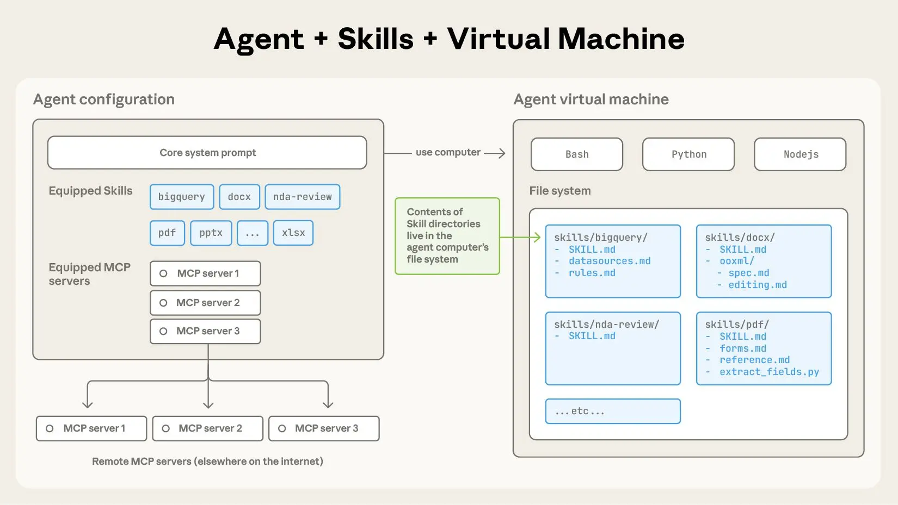

# Equipping agents for the real world with Agent Skills

```
Anthropic发布
20256.2.16
```

**技术思路：通用Agent+Skill（有序的指令skill.md、脚本scripts、references文件、assets模板打包成可组合、专业知识的资源）=垂直领域专用Agent。**
**优势：一个通用Agent、动态发现并渐进式加载不同专业领域的Skill文件夹，完成特定专业领域任务,从而实现完成跨域复杂任务，避免开发定制的专业领域Agent。** 


## skill文件夹结构

### 1.典型的skill文件文件夹结构

skill-name/  \
|── SKILL.md               #必须\
    |── YAML frontmatter   #必须\
    |── Body content       #必须\
|── scripts/               #可选 包含Agent可执行的代码\
|── references/            #可选 包含Agent在需要时可阅读的额外文件（REFERENCE.md、FORMS.md、域特定文件）\
|── assets/                #可选\
### 2.典型skill文件结构
#### （1）YAML格式的前言
YAWL前言格式要说明这个skill干什么用的，何时调用。
**name:**  skill-name，只能是数字和字母，开头、结尾不能用“-”，不能包含“--”，例如pdf-processing\
**description:**  描述skill.md的功能，何时使用，例如：
description: Extracts text and tables from PDF files, fills PDF forms, and merges multiple PDFs. 
Use when working with PDF documents or when the user mentions PDFs, forms, or document extraction.\
**license:**  Apache-2.0\
**metadata:** \
  **author:**  example-org\
  **version:**  "1.0"\
#### （2）skill.md主体内容
包含skill指令，应逐步说明，并给出输入输出例子，常见的边缘情况。

#### （3）