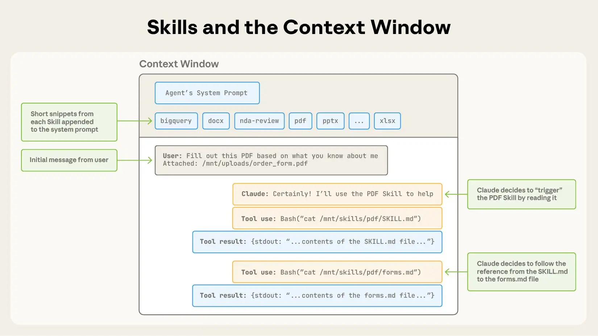
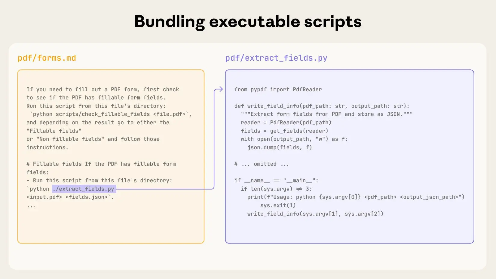

# Equipping Agents for the real world with Agent Skills

```
Anthropic发布
20256.2.16
```

**技术思路：通用Agent+Skill（有序的指令skill.md、脚本scripts、references文件、assets模板打包成可组合、专业知识的资源）=垂直领域专用Agent。**
**优势：一个通用Agent、动态发现并渐进式加载不同专业领域的Skill文件夹，完成特定专业领域任务,从而实现完成跨域复杂任务，避免开发定制的专业领域Agent。**

Agent Skill已在 [Claude.ai](http://claude.ai/redirect/website.v1.bdb29daa-1a07-41ec-87f6-579dc33634bd)、Claude Code、Claude Agent SDK 和 Claude 开发者平台[得到支持 ](https://www.anthropic.com/news/skills)。
[Skill文档说明](https://agentskills.io/specification#progressive-disclosure)


## 一、skill文件夹结构

### 1.典型的skill文件文件夹结构

skill-name/  
|── SKILL.md               #必须
    |── YAML frontmatter   #必须 必须包含name、description字段
    |── Body content       #必须 skill.md的主体正文
|── scripts/               #可选 包含Agent可执行的代码
|── references/            #可选 包含Agent在需要时可阅读的参考文件（REFERENCE.md、FORMS.md、域特定文件）
|── assets/                #可选 包含文档/配置等模板、图片、数据文件等静态资源\

### 2.典型skill.md文件结构

#### （1）YAML格式的前言

YAWL前言格式要说明这个skill干什么用的，何时调用。
**name:**  skill-name，只能是数字和字母，开头、结尾不能用“-”，不能包含“--”，例如pdf-processing
**description:**  描述skill.md的功能，何时使用，例如：
description: Extracts text and tables from PDF files, fills PDF forms, and merges multiple PDFs.
Use when working with PDF documents or when the user mentions PDFs, forms, or document extraction.
**license:**  Apache-2.0
**metadata:** 
  **author:**  example-org
  **version:**  "1.0"

#### （2）skill.md主体内容

包含skill指令，应逐步说明，并给出输入输出例子，常见的边缘情况。

## 二、skill渐进式披露过程

    * 第一层YAWL元数据（~100个token）：所有技能的名称和描述字段在启动时加载
    * 第二层skill说明（ 建议<5000给token）：技能激活时，完整 SKILL.md 体被加载
    * 第三层资源（根据需要）：文件（例如scripts/、references/,、assets/）仅在需要时加载


保持主SKILL.md在 500行以下，将详细参考资料转移到独立文件。使用 skills-ref 参考库来验证你的技能,检查你的 SKILL.md 前置内容是否有效，并且符合所有命名规范：

> skills-ref validate ./my-skill

## 三、Skill与Context窗口


操作顺序如下：
1.首先，上下文窗口包含核心系统提示词和每个已安装skill.md的元数据，以及用户的初始消息;
2.Claude 通过调用Bash工具读取 pdf/SKILL.md 的内容来触发 PDF skill;
3.Claude选择阅读附带的 forms.md 文件;
4.最后，Claude 在加载了 PDF skill中的相关指令后，继续执行用户的任务。

## 四、Skill与代码执行



## 五、Skill的发展与评估

学习编写和测试skill的实用指南：\

* 从评估开始：通过在代表性任务中运行Agent，识别他们能力上的具体缺口，观察他们在哪些方面表现不佳或需要额外背景。然后逐步培养skill，以弥补这些不足。
* 规模结构：当SKILL.md文件变得难以管理时，将其内容拆分成多个文件并引用它们。如果某些上下文互斥或很少一起使用，保持路径分开可以减少令牌使用量。最后，代码既可以作为可执行工具，也可以作为文档。应该很清楚Claude是应该直接运行脚本，还是把脚本读到上下文中作为参考。
* 从Claude的角度思考：观察 Claude 在真实场景中如何运用你的skill，并根据观察进行迭代：注意意外轨迹或过度依赖某些情境。特别注意你skill的名称和描述。Claude会用这些来决定是否触发该skill以应对当前任务。
* 与 Claude 一起迭代： 在你用 Claude 完成任务时，请让 Claude 将其成功的方法和常见错误记录到可重用的上下文和skill代码中。如果在使用skill完成任务时偏离轨道，请它自我反思哪里出了问题。这个过程能帮助你发现Claude真正需要的背景，而不是试图提前预见。

## 六、Skill使用中的安全问题

skill通过指令和代码为Claude提供了新能力。虽然这使它们强大，但也意味着恶意skill可能会在使用环境中引入漏洞，或引导 Claude 窃取数据并采取意外行动。建议如下：

* 只安装可信来源的技能。
* 安装来自不受信来源的技能时，使用前应彻底审核。
  * 详尽的审查skill中捆绑的文件内容，了解它的作用，特别关注代码依赖和捆绑资源，如图片或脚本。
  * 注意skill中指示 Claude 连接潜在不可信外部网络源的指令或代码。
