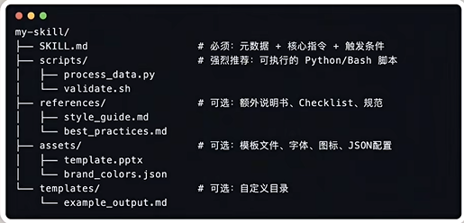
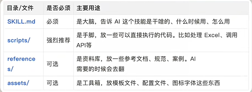

# Skill学习笔记

```
   2026.2.7创建
   2026.2.16补充更新
```

## 一、skills简介

### 1.定义

Skills是一个包含skill.md（指令文件）、scripts（脚本）、references（文档）、assets（模板）、需严格遵循kebab-case命名规范的文件夹，存储干活的规则（如干活指南、成果模板、配色方案和Logo、公司的视觉规范等），把临时调用的Prompt变成永久保存、随时调用的知识资产，让AI瞬间变成某个领域的资深专家。当通用Agent执行任务时检测到Skills文件夹时，会自动加载Skills文件夹。

通用Agent+Skill（有序的指令、脚本和资源文件夹打包成可组合、专业知识的资源）=垂直领域专用Agent。
一个**通用Agent**、动态发现并渐进式加载不同专业领域的Skill文件夹，完成特定专业领域任务,从而实现完成跨域复杂任务，**避免开发定制的专业领域Agent。**

Agent Skills，这是一种利用文件和文件夹构建专业代理的新方法。[Skill官方定义](https://claude.com/blog/skills-explained)，[Skill在github上的文档](https://github.com/anthropics/skills)

### 2.Skill工作原理

当claude遇到任务时，会扫描可用的skill以寻找相关匹配。skill采用渐进披露：元数据先加载（~100 个token），仅提供足够的信息让Claude知道skill是否相关。完整指令在需要时加载（<5个token），捆绑文件或脚本仅按需加载。

### 3.Skill优势

AI采用**渐进式披露机制**，接收到具体任务时才会读取Skills文件夹中scripts和references下的文件资料。具体优势如下：
1.节省Token就是省钱；
2.可积累、传承、交易，挣钱；
3.社区共建，skills生态非常繁荣，github上anthropics有一款skill-creator可以用skills生成skills。

### 4.skill使用场景

当**需要Claude持续高效地完成专业任务时，选择skill。** 它们的理想用途：

* 组织工作流程 ：品牌指南、合规流程、文档模板
* 领域专业知识：Excel 公式、PDF 作、数据分析
* 个人偏好： 笔记系统、编码模式、研究方法
  更详细情况参见[Anthropics官方 Skill lib](https://github.com/anthropics/skills)

### 5.Skill文件夹结构




### 6.如何使用Skill

在本地新建一个Skills文件夹，告诉AI（如Copilot）："帮我把https://skills.sh/remotion-dev/skills/remotion-best-practices安装到本地Skills这个文件夹"即可。

## 二、Skill与其他技术关系

### 1.Prompt

* **定义：** 提示词Prompt是你在对话中用自然语言向claude LLM提供的指令，它们短暂、对话式且反应性强——你在当下提供背景和方向。
* **使用场景：**
  * 一次性请求：“总结本文”
  * 对话技巧改进：“让语气更专业”
  * 即时语境：“分析这些数据并识别趋势”
  * 临时说明：“格式化为项目符号列表”
* **何时用skill代替：**
  Prompt是你与claude LLM**临时互动**的主要方式，但它们不会在对话中持续存在。对于**重复的工作流程或专业知识**，可以考虑将提Prompt作为skill或Project指令来记录。

### 2.Project

* **定义：** Project在所有付费Claude套餐中都可用，是独立的工作区，拥有自己的聊天记录和知识库。每个Project都包含一个20万上下文窗口，您可以上传文档、提供上下文，设置适用于该Project内所有对话的自定义指令。
* **工作原理：** 上传到Project知识库的所有内容都会在该Project的所有聊天中被公开。Claude 会自动利用这些语境提供更有见地、更相关的回答。当你的Project知识接近上下文限制时，Claude无缝启用检索增强生成（RAG）模式，将容量扩展最多10倍。
* **使用场景：**
  * 持续上下文：这些背景知识应当为每一次对话提供指导
  * 工作空间组织：Separate contexts for different initiatives
  * 团队协作： 共享知识和对话历史（关于团队和企业计划）
  * 定制说明： Project特定的语气、视角或方法
* **何时用skill替代：**
  Project为 Claude 提供了针对特定工作组的持续上下文——贵公司的代码库、研究项目、持续的客户参与。skill教会Claude如何做某件事。一个Project可能包含你产品发布的所有背景，而一项skill可以教 Claude 你团队的写作标准或代码审查流程。如果你发现自己在多个Project中复制相同的指令，那就是应该去创建skill的信号。

### 3.subagents分代理

* **定义：** subgents是专门的人工智能助手，拥有自己的上下文窗口、自定义系统提示和特定工具权限。subagent可通过 Claude Code 和 Claude Agent SDK 独立处理离散任务，并将结果返回给main agent。
* **工作原理：** 每个subagent都有自己的配置——你定义它的功能、解决问题的方式以及它可以使用哪些工具。Claude 会根据相关subagent的描述自动委派任务，或者你可以明确请求特定的sugagent。
* **使用场景：**
  * 任务专精： 代码审查、测试生成、安全审计
  * 情境管理： 在分担专业工作时，保持主要对话的重点
  * 并行处理： 多个subagent可以同时处理不同的方面
  * 工具限制： 限制特定subagent的作为安全作（例如，只读访问）
* **何时用skill代替：** 如果多个subagent或对话需要相同的专业知识——比如安全审查程序或数据分析方法——就创建一个skill，而不是将这些知识集成到单个subagent中。skill是可携带且可重复使用的，而subagent则专为特定工作流程设计。利用skill教授任何经纪人都能应用的专业知识;当你需要独立执行任务、特定工具权限和上下文隔离时，可以使用subagent。

### 4.MCP（Model Context Protocol）

* **定义：** MCP是一个开放标准，用于将人工智能助手连接到数据存储的外部系统——内容仓库、业务工具、数据库和开发环境。
* **MCP工作原理：** MCP提供了一种标准化的方式，将 Claude 与你的工具和数据源连接起来。你不必为每个数据源构建自定义集成，只需构建一个协议即可。MCP服务器会暴露数据和功能，MCP客户端（如 Claude）连接到这些服务器。
* **使用场景：**
  * 访问外部数据：Google Drive、Slack、GitHub、数据库
  * 使用商业工具：客户关系管理系统、项目管理平台
  * 连接开发环境：本地文件、IDE、版本控制
  * 集成定制系统：您的专有工具和数据源
* **何时用skill替代：** MCP 将 Claude 连接到数据，skill教会Claude如何利用这些数据。如果你是在解释如何使用工具或遵循流程——比如“查询数据库时，务必先按日期范围筛选”或“用这些特定公式格式化 Excel 报告”——这就是skill。如果你一开始就需要用 Claude 来访问数据库或 Excel 文件，那就是 MCP。两者结合使用：**MCP 用于连接，skill用于程序性知识。**

## 三、Skill与其他工具协作使用

### 1.工具对比

| 特点       | Skills         | Prompts  | Projects     | Subagents        | MCP              |
| ---------- | -------------- | -------- | ------------ | ---------------- | ---------------- |
| 提供的内容 | 程序知识       | 瞬间指令 | 背景知识     | 任务委派         | 工具连接         |
| 持久性     | 跨越对话       | 单次对话 | 项目内       | Across sessions  | 持续的connection |
| 包含       | 指令+代码+资源 | 自然语言 | 文档+上下文  | Full agent logic | Tool definitions |
| 加载时     | 动态、按需调用 | 每回合   | 始终在项目中 | 被调用时         | 随时待命         |
| 能包含代码 | 是的           | 不       | 不           | 是的             | 是的             |
| 最佳       | 专业技能       | 快速请求 | 集中式背景   | 专业任务         | 数据访问         |

### 2.Agent构建流程示例

组装和激活一个Agent流程如下：

* 第一步：设置你的项目research agent
  * 创建Project，上传项目相关资料；
    * 行业报告与市场分析
    * 竞争对手产品文档
    * 来自CRM的客户反馈
    * 以往研究摘要
  * 添加项目说明。
* 第二步：通过 MCP 连接数据源，启用以下 MCP 服务器：
  * Google Drive（访问共享研究文档）
  * GitHub（评审竞争对手开源仓库）
  * 网页搜索（用于实时市场信息）
* 第三步：打造专业skill
  **创建一个“竞争分析”skill**
  ```
  # bash
  # My Company GDrive Navigation Skill

  ## Overview
  Optimized search and retrieval strategy for Meridian Tech's Google Drive structure. Use this skill to efficiently locate internal documents, research, and strategic materials.

  ## Drive Organization
  **Top-level structure:**
  - `/Strategy & Planning/` - OKRs, quarterly plans, board decks
  - `/Product/` - PRDs, roadmaps, technical specs
  - `/Research/` - Market research, competitive intel, user studies
  - `/Sales & Marketing/` - Case studies, pitch decks, campaign materials
  - `/Customer Success/` - Implementation guides, success metrics
  - `/Company Ops/` - Policies, org charts, team directories

  **Naming conventions:**
  - Format: `YYYY-MM-DD_DocumentName_vX`
  - Final versions marked with `_FINAL`
  - Drafts include `_DRAFT` or `_WIP`

  ## Search Best Practices
  1. **Start broad, then filter** - Use folder context + keywords
  2. **Target document owners** - Sales materials from Sales/, not root
  3. **Check recency** - Prioritize documents from last 6 months for current strategy
  4. **Look for "source of truth"** - Files with `_FINAL`, `_APPROVED`, or in `/Archives/Official/`

  ## Research Agent Workflow
  1. Identify topic category (product, market, customer)
  2. Search relevant folder with targeted keywords
  3. Retrieve 3-5 most recent/relevant documents
  4. Cross-reference with `/Strategy & Planning/` for context
  5. Cite sources with file names and dates
  ```
* 第四步：Configure subagents (仅限Claude Code/SDK)
  * 创建market-researcher subagent：
    ```
    # bash
    name: market-researcher
    description: Research market trends, industry reports, and competitive landscape data. Use proactively for competitive analysis.
    tools: Read, Grep, Web-search
    ---
    You are a market research analyst specializing in competitive intelligence.

    When researching:
    1. Identify authoritative sources (Gartner, Forrester, industry reports)
    2. Gather quantitative data (market share, growth rates, funding)
    3. Analyze qualitative insights (analyst opinions, customer reviews)
    4. Synthesize trends and patterns

    Present findings with citations and confidence levels.
    ```
  * 创建technical-analystsubagent：
    ```
    name: technical-analyst
    description: Analyze technical architecture, implementation approaches, and engineering decisions. Use for technical competitive analysis.
    tools: Read, Bash, Grep
    ---
    You are a technical architect analyzing competitor technology choices.

    When analyzing:
    1. Review public repositories and technical documentation
    2. Assess architecture patterns and technology stack
    3. Evaluate scalability and performance approaches
    4. Identify technical strengths and limitations

    Focus on actionable technical insights that inform our product decisions.
    ```
* 第五步: Activate your research agent
  现在当你问 Claude：“分析我们的前三大竞争对手如何定位他们的新 AI 功能，并找出我们可以利用的差距。”激活结果如下：
  * 项目上下文加载 ：Claude 访问你上传的研究文档并遵循项目指令
  * MCP 连接激活 ：Claude 会搜索你的 Google Drive，查找最近的竞争对手简报，并拉取 GitHub 数据
  * Skills参与 ：竞争分析skill提供分析框架
  * Subagents执行（用 Claude 代码）：市场调研员收集行业数据，技术分析师审查技术实施
  * Prompts精炼 ：你提供对话指导：“特别关注医疗领域的企业客户”
    最终结果如下： 基于多个数据来源，遵循您的分析框架，利用专业知识，全面分析竞争，并在研究项目中保持上下文语境。

## 四、可用资源

### 1. [skills网站](https://skills.sh/)、[Clawhub skill网站](https://clawhub.ai/)

### 2.[remotion-best-practices资源仓库](https://skills.sh/remotion-dev/skills/remotion-best-practices)

### 3.NotebookLM Skill

神级Skills，通过它可以直接让AI对接NotebookLM，自动上传资料、做知识问答、生成PPT、脑图都能搞定。

### 4.Obsidian Skills

Obsidian CEO出的 Skill套件，功能很全:直接写出Obsidian 风格的Markdown(内链、属性等)生成.Base文件的过滤器和公式生成Canvas无限画布。

### 5.planning-with-files

复刻Manus 的Skill，可以用这个Skill来指导其他Skil的工作流程。能有效解决上下文飘移的问题。

### 6.anthropics/skill-creator

自己做Skil时候的首选，可以直接通过它创建一个符合最佳实践的Skill，也可以用它来优化现有的Skill。

### 7.frontend-design

前端设计专用，比如可以帮你去掉AI的渐变色。

### 8.Superpowers

Obra开发的工具包，包含/brainstorm 、 /write-plan . /execute-plan等命令。可以在你做复杂项目时，讨论方案、和你一起脑暴，还会通过提问来分析问题生成靠谱的方案。

### 9.Rube MCP Connector

通过一个服务器就能把Claude连接到大概500个应用(Slack、GitHub、Notion等)，不用给每个应用单独配置授权。

### 10.baoyu-skills

宝玉老师出品的Skil套件，比如写长文帮你自动配图的Skill，自动发推、发公众号的Skill。

### 11.香蕉的自媒体Skil系统

自己开发的Skill套装，覆盖日常选题、写脚本、写文案、数据分析等工作。

### 12.skill-lookup

当你想找、安装Skil的时候就会自动激活。用来发现、检索和安装Skill。
