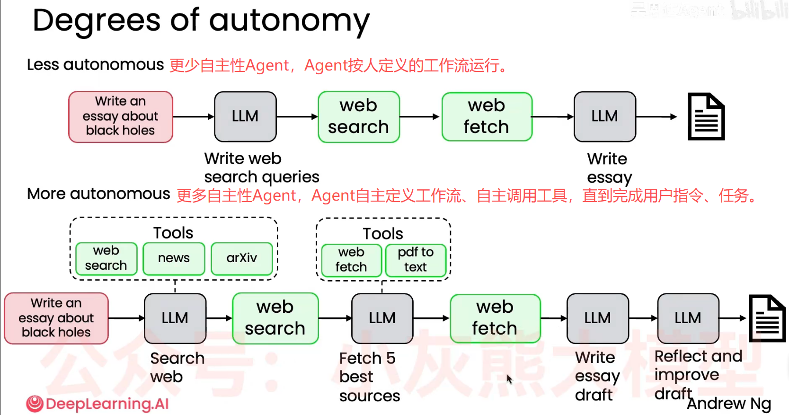
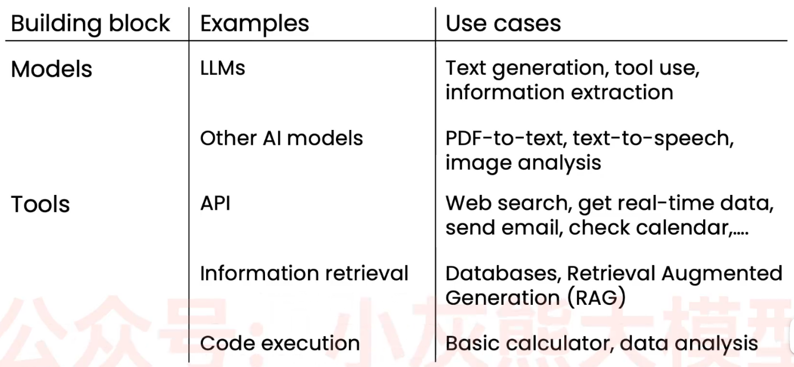

# Agent workflow智能体工作流简介

> 创建：2026.3.25 \
> 视频链接：【【吴恩达】2026年公认最好的【Agent智能体】教程！https://www.bilibili.com/video/BV1DfrdByE2H?p=5&vd_source=f432e53fd4216d9d263cf1d6ef32c226

## 一、Agent AI Workflow智能体工作流
Agent AI Workflow是**基于LLM、执行多步操作去完成复杂任务**的应用软件。
### 1. Agent AI Workflow典型工作步骤
- Thinking:按用户要求（用户输入的Prompt）构思任务解决思路；
- Web Search:是否需要联网搜索、查找资料？
- Write:根据构思和资料搜索结果，提出一个初步的任务解决方案；
- Reflect+人工参与:考虑一下，哪些内容需要反思、再研究？可以在反思阶段增加人工参与（例如审核）环节；
- Revise：修改任务解决方案；
- 重复上述步骤，直至任务解决方案让被调用的LLM满意。

### 2. Reflective Research Agent反思研究型智能体案例
反思研究型智能体典型工作流程：
- Research Agent：执行互联网搜索、资料收集；
- Research Agent：基于互联网收集的资料，在行业、专业的网站上搜索，进一步收集资料；
- Research Agent：资料去重，按与任务的相关性、权威性、时间远近排序，合成最终资料；
- Writer Agent：基于资料收集、分析的结果，起草任务提纲框架；
- Editor Agent：检查连贯性、覆盖范围、引用、完整性、请求修复；
- Writer Agent：生成最终全面的Markdown格式报告，附件中有在线引用资料的超链接。

## 二、Agent自主性程度
Agent自主程度越高，越难以被控制和预测其行为。
- 自主性少的agent（基于工作流）特点：
  - 工作流是人为预先确定的；
  - 外部工具调用是预先人工编码确定的；
  - 回答文本是LLM自主生成的。

- 自主性居中的agent特点：
  - agent自主部分决策、自主调用外部工具；
  - 外部工具是预先人工编码确定的；
  - 自主生成回答文本。

- 高度自主agent特点：
  - agent自主做出决策，例如LLM自主完成任务分解；
  - agent自主调用外部工具、编写函数并执行；  
  - 自主生成回答文本。

     
图 1.7 Agent自主性对比

## 三、Agent AI优势
基于workflow的Agent最大的优势是：
- 高效完成以前无法实现的工作；
- 能并行处理任务，所以比人类工作效率高；
- 模块化设计，可以增加、更新工具，更换LLM，能将多个不同组件的优势结合起来，组建成高效工作流；
- LLM代际性能提升程度，远不及工作流式Agent调用LLM带来的的性能提升。

## 四、Agent AI应用
Agent AI最适合的应用场景特点如下：
- 任务执行的流程清晰、步骤明确；
- 有标准化操作流程；
- 只处理文本资源。

Agent AI很难适合的应用场景特点如下：
- 任务执行步骤事先不明确；
- 任务需要边规划、边执行解决；
- 需要接入多模态输入，例如图片、视频、声音等，比处理文本更不可靠。

Agent AI应用程序构建核心技能：**分析复杂流程，找出各个独立的步骤，这样才能确保Agent按工作流程顺序执行每一步。**

## 五、Agent AI任务分解：识别工作流中的步骤
思路：
- 人类要完成一个复杂任务，正常做法是把复杂任务拆分成一个个有序、独立的子任务，然后逐个完成子任务，最后整合、梳理所有子任务成果，进行前后一致性检查，对存在问题的子任务进行再次调整，循环以上步骤，直至解决问题。
- Agent完成复杂任务，构建工作流的过程，基本上也遵循上述基本思路，如下：
  - LLM任务拆解，生成行动计划；此阶段也可以让LLM reflection and revise行动计划，并修改完善；
  - LLM自主决定调用工具，或按Agent管理的行动计划执行子任务，生成子任务结果，直至完成全部行动计划中的子任务；
  - Agent让LLM 整合所有子任务成果，生成复杂任务初步解决方案；
  - Agent让LLM Revise and Reflec解决方案，循序上述步骤直至完成任务、达成目标。
- Agent工作流构建是一个不断优化改进的过程：
  - 首先初步拆解任务，构建一个初步的工作流；
  - 让智能体按初步工作流执行任务，评估任务完成效果；
  - 不断迭代、优化工作流程，直至达成预期效果  

    
    
构建Agent的工作内容

## 六、Agent AI工作流评估(evals)
Agent工作流评估的规范程度，直接决定了Agent最终的工作效率和质量。Agent工作流评估常见方法如下：
- 构建Agent工作流之前难以提前预料问题时，可以先构建Agent，查看Agent的输出结果，找出希望改进的地方。然后在寻找评估和改进系统的方法。
- 编写代码或者利用LLM，评估Agent输出质量客观指标；
- 端到端（End-to-End）整体评估：可以衡量Agent整体输出成果的质量；
- 组件级（Componet-Level）局部评估：可以评估Agent工作流程某一个步骤的输出成果质量；
- 大模型轨迹追踪与错误分析：Examine traces to Perform error analysis,逐步分析llm每个中间输出结果，寻找改进机会；

**具备对Agent的评估和错误分析的能力，是非常关键的技能**。

## 七、Agent设计模式
Agentic workflow构建的4个关键设计模式如下：
- Reflection反思：通过多agent协作，可以大幅提升Agent生成成果质量，但并不能保证每次都100%成功。
  - 让**反思LLM**检查**任务执行LLM**的输出结果，或者引入外部信息来源；
  - 把反思的结果再次迭代给任务执行的LLM，让其生成更优秀的输出成果；；
- Tools use：LLM可以调用函数来完成任务。 
- Planning：LLM能自主拆解任务、调用工具去完成任务。具备规划能力的agent更难控制，也更有实验性。
- Multi-agent collaboration：为每个agent设置独立的角色定位，设计多智能体工作流程。