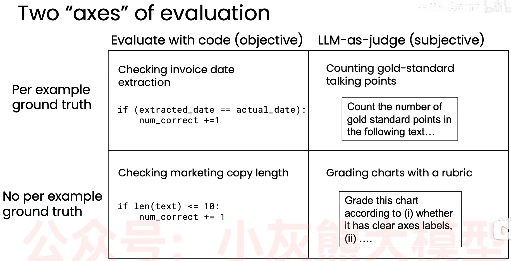

# Agent evals and error analysis智能体评估和错误分析
> 创建：2026.3.29

**能否推动有纪律的agent workflow 开发评估流程，是高、低效团队区别的关键**。\
**具备对Agent的评估和错误分析的能力，是非常关键的技能**。

## 一、Agent评估的工作流程
Agent工作流评估的规范程度，直接决定了Agent最终的工作效率和质量。\
Agent工作流评估原则：**快速搭建原型，观察系统表现，确定精力投入环节，持续改善**
- 1.Agent评估工作流程
  - 先构建粗糙的Agent工作流；因为构建Agent工作流之前难以提前预见问题，所以难以决定把精力重点投入到哪个环节。
  - 选择10-20个数据集测试Agent功能，观察并记录（用excel记录每个实测数据的agent输出、存在的问题）未达预期的地方（此处也可以创建agent质量测评方法）；
  - 建立agent质量评估方法，因业务功能不同、出错地方不同，评估方法也不同，以下是一个示例：
    - 评估方法一：
        - 在Prompt中规定LLM输出的格式；
        - 编码，从LLM response中按预定格式提取信息；
        - 比较LLM response与正确结果的差异，计算测试数据集的正确率。
    - 评估方法二：
        - 为每个topic选择3-5个核心讨论点；
        - 用LLM作为评估工具，统计agent生成的内容提及了多少讨论点；
        - 为每个评估集的Prompt打分；
  - 分析测试和评估发现的问题，有针对性的在此处投入精力，完善系统；
  - **持续迭代**：agent调优、评估体系调优。

- 2.评估体系构建要点
  - 评估体系构建原则：评估体系**要反应应用程序关注的地方、担心出错的地方**。
  - 关注agent表现不佳或出错的测试数据集，对提升agent效果非常有用。 
  - agent调整过程中，追踪每次调整得出的正确率变化情况，从而判断agent调整的成效。 
  - 初始10-20个数据集可以更换、扩大数据集规模。
  - 当你能明显感觉agent调优后效果提升显著，但评估结果却没有体现出得分更高，此时，需要收集更大的评估数据集，或者调整评估方式。

- 3.评估体系维度划分
  - 主观、客观评估维度
  - 每个样本是否有真实值(per-example ground truth) 
  

     
     
agent评估体系维度划分

  
   

## 二、评估方法
评估方法有端到端（End-to-End）整体评估、组件级（Componet-Level）局部评估两种。

- 1. 端到端（End-to-End）整体评估：可以衡量Agent整体输出成果的质量；
  - agent表现效果不佳，可能是LLM提取搜索的关键词不当、搜索工具搜索质量低下、LLM选择和抓取搜索结果较差、LLM遗漏抓取内容的要点等；
  - agent trace（智能体轨迹）：agent和LLM所有中间步骤的输出集合；
  - agent和LLM span（跨度）：agent和LLM的单步输出结果；
  - 大模型轨迹追踪与错误分析：Examine traces to Perform error analysis,逐步分析agent和LLM每个中间输出结果，了解agent工作流每一步都在做什么，判断每一步表现优劣，再寻找改进机会；
    - 逐步分析agent和LLM的每个中间输出结果，就能初步判断agent最终的输出质量；
    - 建立错误分析统计表：表头每一列为agent全部组件或者重点组件名字，每一行对应一个测试数据集，每个单元格的内容为某个测试数据在某个组件运行时产生的中间结果评价或者错误信息（即输出结果明显低于人类专家知识）；
    - 计算错误分析统计表每一列的错误率，由高到低排序；agent调优环节的优先顺序由错误率高到低进行；
    - 错误分析能帮助我们选择努力的方向，极大提升agent调优效率；复杂系统中需要优化的环节很多，每个环节优化都需要花费大量的时间；

- 2. 组件级（Componet-Level）局部评估：可以评估Agent工作流程某一个步骤的输出成果质量；
  - 

  

