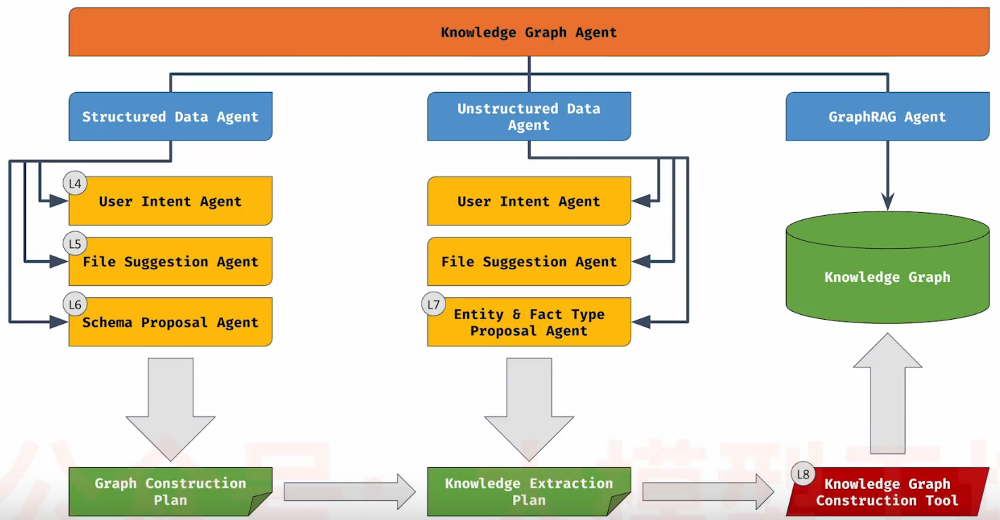

# 知识图谱agent
> 创建：2026.4.8

## 一、知识图谱简介
1.什么是知识图谱
  - 是一种用节点(内含Entities)和边(表示节点之间的关系)表示信息的数据库；
  - 节点Nodes代表实体Entities，边Edge代表节点间的关系，节点和边是有语义信息的记录；
  - 节点和关系都有键key和值value；
  - 节点可以有多个标签，关系有方向性、且只有一个类型；
  - 用Cypher查询语言进行模式匹配。

 知识图谱非常适合映射自然语言，很方便与生成式AI结合使用（因为LLM非常擅长处理自然语言），原因如下：
   - 知识图谱很容易把结构化数据和非结构化数据结合起来使用
   - 可以任意添加文本做向量化表示并存入向量数据库
   - 结合向量相似度搜索和模式匹配，实现强大的访问方式

知识图谱包括领域图domain graph、主题图subject graph和词汇图lexical graph。     

2.知识图谱构建主要工作
  - 知识图谱系统会将文本或者结构化数据拆分成片段(chunk)，并存储在向量数据库中；
  - 知识图谱将片段(chunk)存入草稿结构(draft structure)中，从片段(chunk)中提取的实体，提取的实体与对应的片段(chunk)通过一条边(边表示关系)关联；
  - 检索实体与片段(chunk)，为LLM提供上下文context，从而生成更精准的答案。

3.知识图谱构建主要步骤
  - 确定图谱模式：能从数据中提取哪些实体(Entities)和节点(Nodes)，以及他们之间存在的哪些关系；
  - 构建知识图谱，存储到图数据库中；
  - 设置一个多agents系统，利用Google ADK 或者Agent Development Kit实现。
    - 逐步设计agent系统，每次添加一个agent；
    - 与第一个agent对话，用于提取你的目标和想构建的图谱类型；
    - 一组agents专注于从结构化数据中提取实体、关系；
    - 一组agents专注于从非结构化数据中提取实体、关系； 
    - 一组agents会连接两种agents，构建知识图谱。

4.知识图谱agents结构

    
    
知识图谱典型架构图

- 知识图谱智能体(knowledge graph agent)：
  - 顶层对话型agent，负责整体引导用户，介绍agent职责，不执行具体工作；
  - 通过工作流引导用户：从知识图谱构建一直到图谱检索
- 结构化数据智能体(structured data agent):是workflow agent,从.cvs等文件中导入结构化数据，与subagent交互，其构成如下：
  - 用户意图智能体(user intent agent):对话型agent，协助用户确定数据导入、分析的目标，明确需求。
  - 文件建议智能体(file suggestion agent):工具型agent，参考用户意图agent确定的方向和目标，分析和建议相关的结构化数据文件列表，并把文件列表输出到模式提议agent。
  - 模式提议智能体(schema proposal agent):以批判模式组成的agents，一个agent提出模式设计方案，另一个agent提出评估、自我批评和修改意见，循环迭代优化出一个满足用户意图、合适的知识图谱模式；
  - 上述3中agent协作工作，最终输出图谱构建计划(不是图谱本身)，即将.cvs等结构化文件转换成知识图谱的构建规则。

- 非结构化数据智能体(unstructured data agent):是workflow agent,从.md等文件中导入非结构化数据，与subagent交互，其构成如下：
  - 用户意图智能体(user intent agent):对话型agent，协助用户确定数据导入、分析的目标，明确需求。
  - 文件建议智能体(file suggestion agent):工具型agent，参考用户意图agent确定的方向和目标，分析和建议相关的结构化数据文件列表，并把文件列表输出到模式提议agent。
  - 实体和事实建议智能体(entities and fact type proposal agent):工具型agent，协助用户从md文本中识别、提取实体及其事实的类型；
  - 上述3中agent协作工作，最终输出知识抽取计划(不是知识本身)，即将.md等非结构化文本转换成知识的构建规则。

- 结合结构化数据图谱构建计划和非结构化文本知识抽取计划，得到知识抽取和图谱沟通的全部规则，利用知识图谱构建工具完成知识抽取、图谱构建：
  - 遍历所有结构化数据的构建规则，创建领域图谱(domain graph);
  - 遍历所有.md文本，分块(chunk)，做向量嵌入，抽取实体及其事实；
  - 将非结构化实体及其事实与结构化数据创建的领域图谱关联。  
  

- 图谱检索智能体(graphRAG agent):
  - 属于工具使用agent，利用图谱回答用户的问题

## 二、Google ADK介绍

## 三、了解用户的意图

## 四、文件建议

## 五、结构化数据架构

## 六、非结构化数据架构

## 七、知识图谱构建

## 八、总结