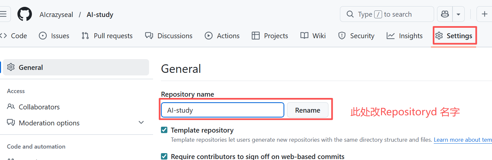

# 一、常见问题（已解决）
1.在Extension扩张中，安装Office Viewer插件后，markdown格式可另存为word格式：打开*.md文件，全选中文件中的内容，如下图即可。注意：但是这个插件与office在样式排版上还是不一样。

2.vscode插件问题：可以在vscode界面的Extensions中搜索插件，点击插件即可查看插件的功能，可以安装、卸载。本次安装了MDOffice，解决了office文件在vscode中编辑、预览的问题。

3.在github的Repository中下载某一个文件，理论可行，实际不行。

4.可以修改已建成的repository的名字

5.GitHub desktop是图像版Git。
vscode安装完Git后可以直接在vscode软件内，实现本地与网上同步。
推荐使用GitHub desktop实现同步，因为这个软件可以自动编写commit输入栏中的更新描述。

6.github网页、vscode和github Desktop都可以从某个历史修改版本中，右击选择创建一个新的分支branch。

